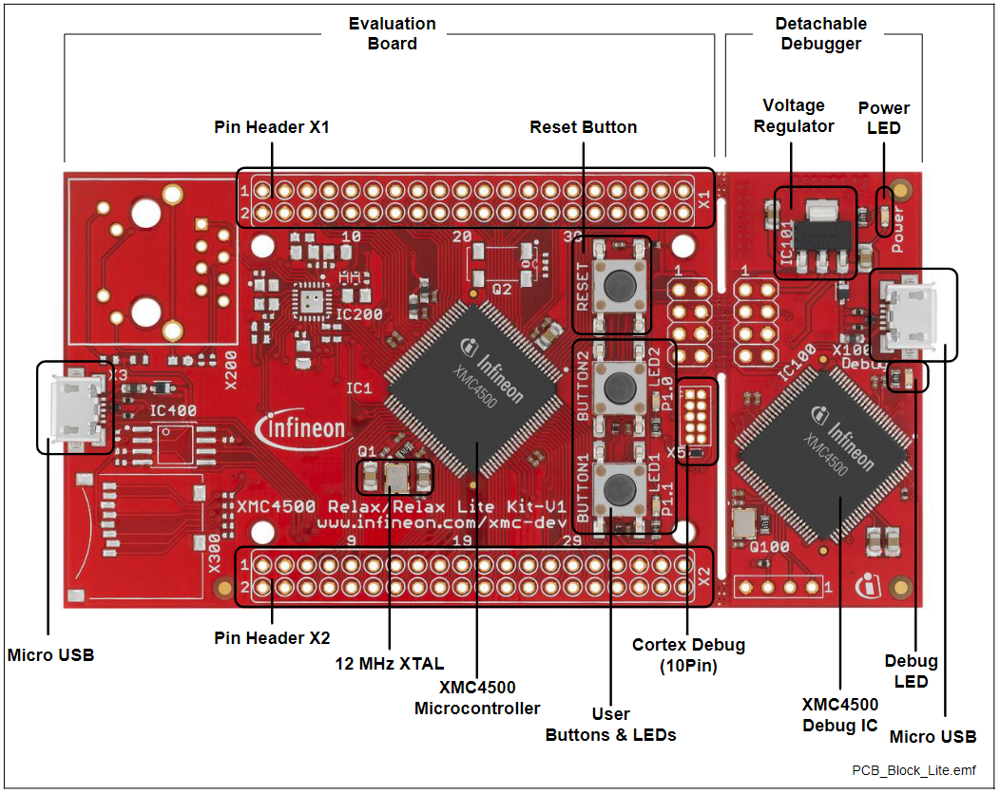

# KIT_XMC45_RELAX_LITE_V1 BSP

## Overview

XMC4500 Microcontroller - Detachable on-board debugger - Power over USB - ESD and reverse current protection - 2 x user button and 2 x user LED - 4 x SPI-Master, 3x I2C, 3 x I2S, 3 x UART, 2 x CAN, 17 x ADC (12 bit), 2 x DAC, 31x PMW mapped on 2 Pin Headers 2 x 20 0.1" - Micro-USB plug - Ethernet PHY and RJ45 jack - Real Time Clock crystal - 32 Mbit Quad-SPI Flash - microSD card slot.     
**Note:**
Programming this kit requires installing 
[SEGGER J-Link software](https://www.segger.com/downloads/jlink/#J-LinkSoftwareAndDocumentationPack)

To use code from the BSP, simply include a reference to `cybsp.h`.

## Features

### Kit Features:

* XMC4500 Microcontroller (ARM® Cortex™-M4F based)
* Detachable on-board debugger
* Power over USB
* ESD and reverse current protection
* 2 x user button and 2 x user LED
* 4 x SPI-Master, 3x I2C, 3 x I2S, 3 x UART, 2 x CAN, 17 x ADC
* (12 bit), 2 x DAC, 31x PWM mapped on 2 Pin Headers 2 x 20 0.1”
* Micro-USB plug

### Kit Contents:

* KIT_XMC45_RELAX_LITE_V1 evaluation board

## BSP Configuration

Components:

# TARGET_XMC4500_MIDI_USB
The board support package for ModusToolbox and the XMC4500 Midi project.
This BSP configures all peripherals I want to use in this project:
* one UART for debuggin
* three UARTs for the Midi channels
* one I2C bus for an LCD display
* the USB bus (with Segger emUSB device driver)
* the real time clock
* the watchdog timer
* four input pins for buttons
* two output pins for LEDs
* three input pins for a rotary switch

See the [BSP Setttings][settings] for additional board specific configuration settings.

## More information
* [KIT_XMC45_RELAX_LITE_V1 Documentation](https://www.infineon.com/cms/en/product/evaluation-boards/kit_xmc45_relax_lite_v1/)
* [Cypress Semiconductor, an Infineon Technologies Company](http://www.cypress.com)
* [Infineon GitHub](https://github.com/infineon)
* [ModusToolbox™](https://www.cypress.com/products/modustoolbox-software-environment)

---
© Cypress Semiconductor Corporation (an Infineon company) or an affiliate of Cypress Semiconductor Corporation, 2019-2024.
